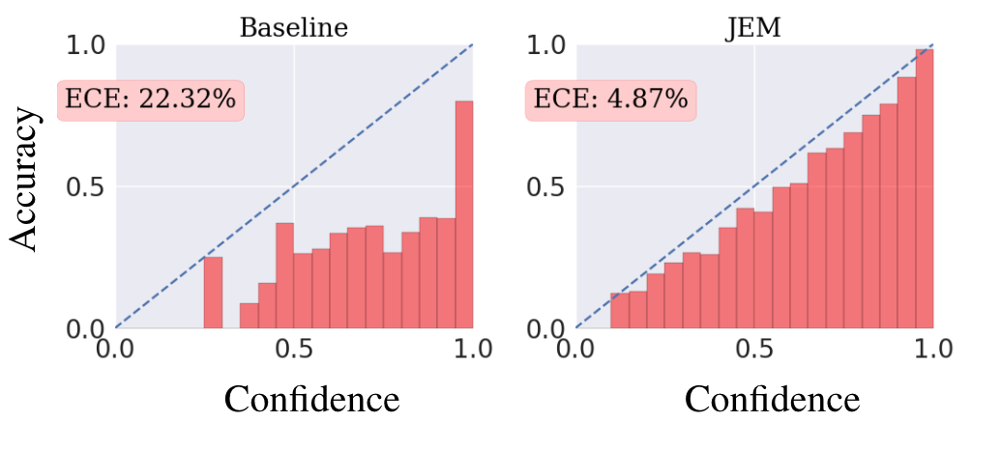

# JEM - Joint Energy Models

Code for the paper [Your Classifier is Secretly an Energy Based Model and You Should Treat it Like One](https://arxiv.org/abs/1912.03263).

We show that architectures traditionally used for classification can be reinterpreted as energy based models of the joint distribution over data and labels p(x, y). 

Training models in this way has many benifits including:

Improved calibration:


### Abstract

We propose to reinterpret a standard discriminative classifier of p(y|x) as an energy based model for the joint distribution p(x,y). In this setting, the standard class probabilities can be easily computed as well as unnormalized values of p(x) and p(x|y). Within this framework, standard discriminative architectures may beused and the model can also be trained on unlabeled data. We demonstrate that energy based training of the joint distribution improves calibration, robustness, andout-of-distribution detection while also enabling our models to generate samplesrivaling the quality of recent GAN approaches. We improve upon recently proposed techniques for scaling up the training of energy based models and presentan approach which adds little overhead compared to standard classification training. Our approach is the first to achieve performance rivaling the state-of-the-artin both generative and discriminative learning within one hybrid model.

### Markdown

Markdown is a lightweight and easy-to-use syntax for styling your writing. It includes conventions for

```markdown
Syntax highlighted code block

# Header 1
## Header 2
### Header 3

- Bulleted
- List

1. Numbered
2. List

**Bold** and _Italic_ and `Code` text

[Link](url) and 
```

For more details see [GitHub Flavored Markdown](https://guides.github.com/features/mastering-markdown/).

### Jekyll Themes

Your Pages site will use the layout and styles from the Jekyll theme you have selected in your [repository settings](https://github.com/wgrathwohl/JEM/settings). The name of this theme is saved in the Jekyll `_config.yml` configuration file.

### Support or Contact

Having trouble with Pages? Check out our [documentation](https://help.github.com/categories/github-pages-basics/) or [contact support](https://github.com/contact) and we’ll help you sort it out.
